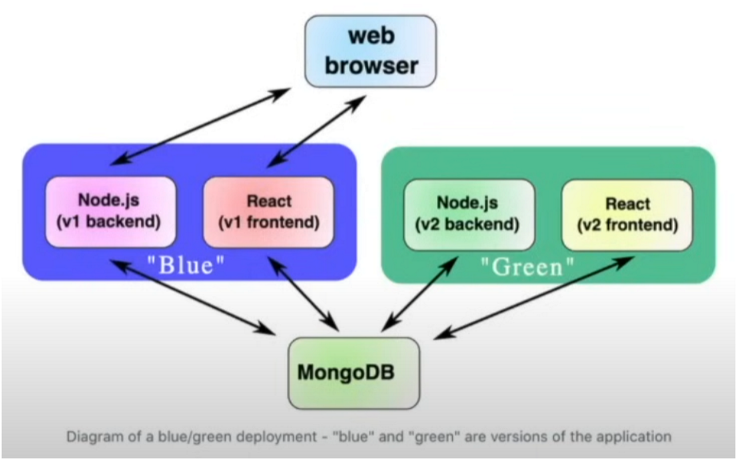
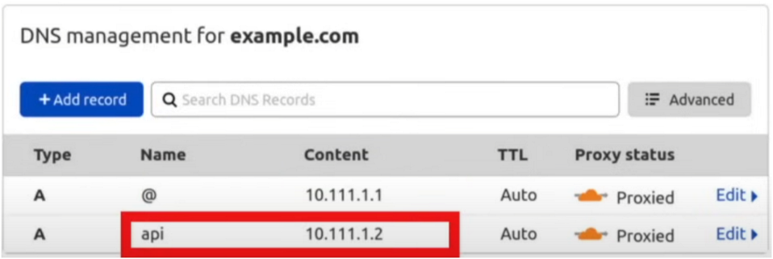
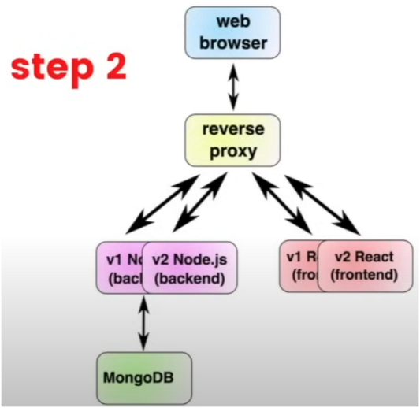
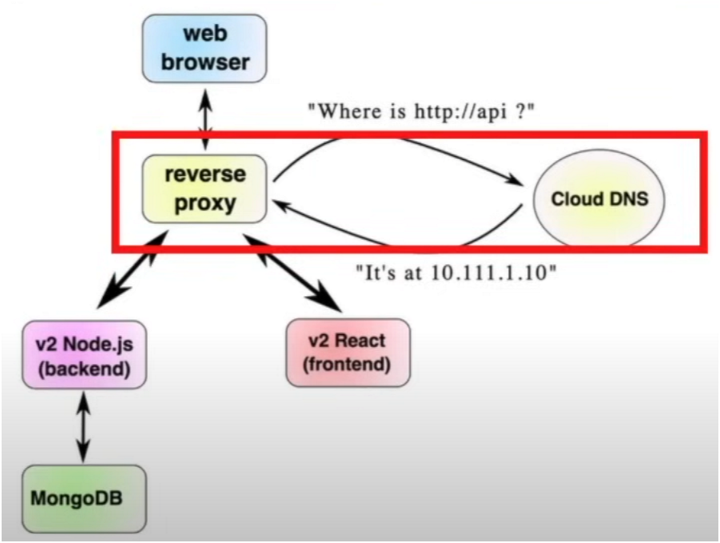
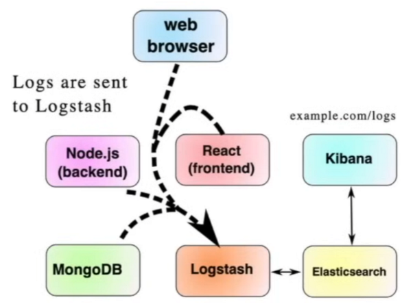
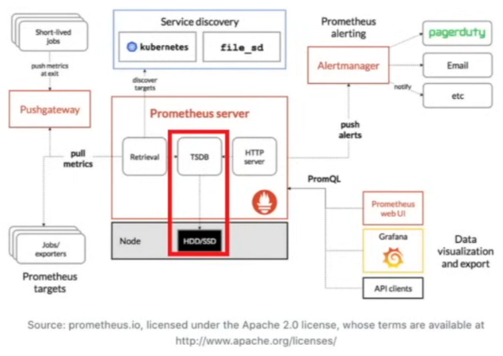

# Introduction
CONTAINERS VS VIRTUAL MACHINES
VM's vs containers performance:
- VM's CPU slower by 10-20% than on containers
- VM's use 50-100% more storage (OS files)
- VM's use more memory for the inner OS

When VM's are the better choice
- Running untrusted code (eg. User supplied), avoiding the escaping of the container
- Running Win/ MacOs on Linux server
- When needing to emulate hardware devices

## ROLLING DEPLOYMENTS
Strategy to deploy a new version of an app without causing downtime
Systematically create instances with the newer version, reroute traffic, delete old instances and repeat

## BLUE/ GREEN DEPLOYMENTS
Two versions where each is a standalone stack (two clusers blue and green)

- Rainbow deployment: Have more clusters, let long running tasks end
- Canary deployments: Subjective changes for big target groups (expose 5% of users to deployment) and check for negative feedback

## AUTOSCALING AND SERVERLESS
- Automation of horizontal scaling to balance changes in load
- Serverless ~100 ms, applications that boot fast and stateless (f.e. notification service)

## SERVICE DISCOVERY
- Manual configuration of dns (level 1)

- Reverse proxy: Maps the appropiate resourcess based on its config (nginx)
- Level 2 - hash table used in the reverse proxy. When booting services we can update and create IP mappings
- Complex, error prone, custom config files

- Local DNS or Cloud DNS
- Easier for developers to have microservices talk together, we just use aliases that the DNS maps
- Decoupling app logic from deployment logic

## APPLICATION PERFORMANCE MANAGEMENT
- Log aggregation: In devops it would be aggreagating logs and presenting them on a dashboard, logs collected from different services and apps
- ELK -> Data store (Elasticsearch), log processor (logstash), log frontened (kibana)
- Authentication can be set up on the reverse proxy.

- Metric aggregation: (Prometheus) open source metric service, example frontend f.e. Grafana

