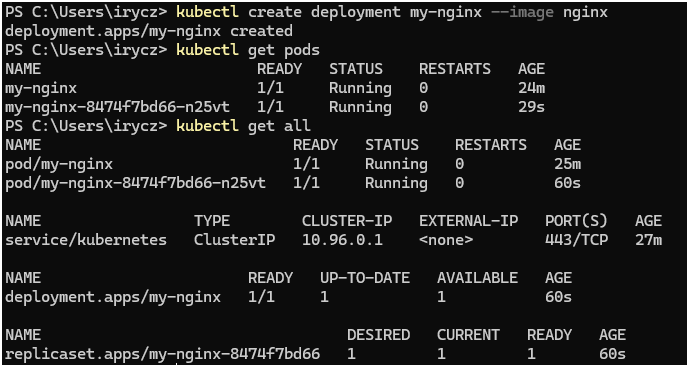
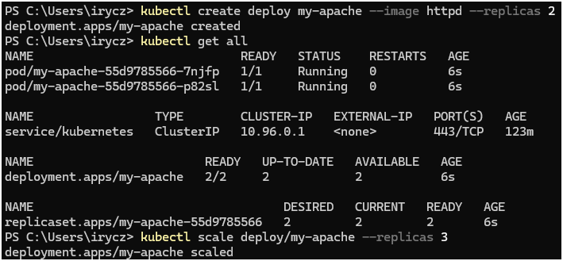
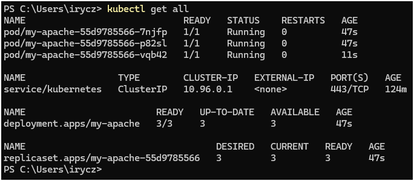

# Core
## Basic terms:
- Kubectl: CLI to configure and manage apps
- Node: single server in the k8s cluster
- Kubelet: agent running on each node to enable communication between the k8s master and the node containers.
- Control Plane/ Master: set of containers that manage the cluster
  - Includes API server, scheduler, controller manacer, core DNS, etcd

Odd number of masters to keep consensuns using the RAFT protocol
Kubernetes is a series of containers, be it master or worker each functionality is a container

## Container abstractions:
Pod - basic unit of deployment, one or more container running together on one Node, containers are always in pods. 
Controller - for creating/updating pods and other objects
- Deployment (similar ro services in swarm), ReplicaSet, StatefulSet, DaemonSet, Job, CronJob, etc

Service - network endpoint to connect to a pod, persistent endpoint in the cluster with its dns name an port
Namespace - Filtered group of objects in a cluster
Secrets, config maps, third party utilities

## Pods why do they exist?
Pod is a layer of abstraction (idea of resource type) that wraps around one or more containers that share the same ip address and the same deployment mechanism. Have access to each other through localhost.
You can't create a container directly in k8s, first you create a pod then the control plane know that k8s has to create the containers specified. Kubelet comunicates to the container runtime (docker) and it tells them to run containers.

### Cheat sheet:
https://cheatography.com/sam15/cheat-sheets/kubectl/
https://cheatography.com/gauravpandey44/cheat-sheets/kubernetes-k8s/

``Kubectl run``
Create and run a singular pod

``Kubectl create``
Create many type of resources

Creating a deployment:

1. ``Kubectl create deployment`` on host 
2. Request sent to API
3. Storing the record of deployment in etcd 
4. The control manager has controllers for each resource type that are responsible for updating instances of their resource basend on the database. In this case c-m looks at resource types (sees new deployment resource), creates ReplicaSet resource. The ReplicaSetController sees this new definition and knows that it has to create the respective pod records in the db.
5. The scheduler seed this new records that are not scheduled to a node and does that. Once the pod has been scheduled for a node then it's assigned to a kublet
6. kubelet finds the record through the API and tells the runtime to create it
7. The containers get created

ReplicaSets are created for each new deployment type, for each version of the deployment k8s creates new ReplicaSets. 
Deployment -> ReplicaSet -> Pods

## Creating single pod

## Scaling ReplicaSets

 1. Kubectl scale will change the deployment/my-apache record
 2. Cm will see that only replica count has changed
 3. It will change the number of pods in ReplicaSet
 4. Scheduler sees a new pod is requested, assigns a node
 5. Kubelet sees a new pod, tells container  runtime to start httpd

## Inspecting resources

``kubectl get <resource> -o <wide/ yaml/ json/…>``
Ideal for getting some info or even all the information of a single resource

``kubectl describe <resource>``
Concise view of the important details that combines related resources

Typical scenario from high level to low level
``kubectl get nodes``
``kubectl get node docker-desktop -o wide``
``kubect describe node docker-desktop``

Watching resources - realtime
``kubectl get pods -w``
``kubectl delete pod/my-apache-xxx-yyy``

To watch the pod get re-created
``kubectl get events``
``kubectl get events --watch-only`` (get only future events)??
The linux watch command can be use to only see the current status instead of the history
Container logs in kubernetes
Logs are stored by default on each node with the container runtime. The k8s log command tells the API to then tell the kubelet on each node to start sending the logs back to the API, and the returns them.

``kubectl logs deploy/my-apache``
Get a container's logs (picks a random replica, first container only)

``kubectl logs deploy/my-apache --follow --tail 1``
Follow new log entries, and start with the latest log line.

``kubectl logs pod/my-apache-xxx-yyy -c <?container-name>``
Get a specific container's logs in a pod. We get the containername from the get or descirbe cmmd for a pod

``kubectl logs pod/my-apache-xxx-yyy --all-containers=true``
Get logs of all containers in a pod

``kubectl logs -l app=my-apache``
Get multiple pods logs. We can check the labels using the describe cmd of the deploy we want to check.

Normally when on a project centralized logging systems are used. A nice utility that makes logging a bit esier is stern (a bit more advanced than the kubernetes logs)
https://github.com/stern/stern

--- 

#### Q: What two keys in a resource connect a Deployment to its ReplicaSets, and a ReplicaSet to its Pods? -> Selectors and labels
Yes, a resources Selector will list the Labels it needs to match in child resources. Said another way, a resources Labels are how a parent resource finds it.

