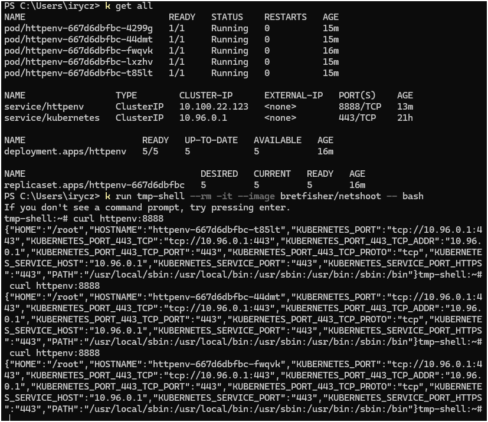

# Networking, Services, Exposing ports
Exposing containers
In kubernetes to expose a container we use the ``kubectl expose`` command. This creates a service for existing pods which Is a stable address. If we want to connect to pod(s), we need a service.
CoreDNS allows us to resolve services by name
There are four different types of service:
    - ClusterIP
    - NodePort
    - LoadBalancer
    - ExternalName

ClusterIP (default)
    - Single virtual IP allocated inside the cluster
    - Only rechabel from within cluster (nodes and pods)
    - Pods can reach service on apps port number

NodePort
    - High port allocated on each node
    - Port is open on every node's IP
    - Anyone can connect (if they can reach node)
    - Other pods need to be updated to this port

These services are always available in Kubernetes

LoadBalancer
    - Controls a LB endpoint external to the cluster (controlling the external LB using the k8s command line)
    - Only available when infra provider gives you a LB (AWS ELB, etc)
    - Creates NodePort+ClusterIP services, tells LB to send to NodePort
ExternalName
    - Adds CNAME DNS record to CoreDNS only, so that the cluster can resolve dns names to outside services
    - Not used for Pods, but for giving pods a DNS name to use for something outside Kubernetes
    - Exmpl: migration
Kubernetes Ingress

The standard DNS used in Kubernetes is the CoreDNS project, and is usually installed as part of your Kubernetes distribution because you can't use Kubernetes Service resources without it. In order to talk from one Pod to another pod, you usually need a Service endpoint, and that requires friendly DNS names, which require CoreDNS to resolve inside the cluster network. Services are used in every cluster I've seen, so I consider CoreDNS a required service in any Kubernetes.

Example of ClusterIP setup and communication

Httpenv - web server that spits up env variables when accessing it through http
Httpenv is our CluserIP service, kubernetes is the API (always active)

The name of the service, in this case httpenv becomes the DNS name of the service. So we can use it in the new created pod to access the pods in the deployment created at the beginning. Now different pod's respond to the curl httpenv:8888.

CoreDNS DNS based service discovery, workd the same way as in docker and swarm. When you create a service you get a hostname that matches the service, that hostname is part of a larger name, the fullt qualifies domain name. That is unique to qubernetes in docker on swarm you only have hostnames. Out of the box hostnames work, but when you start using namespaces, which are used to section off all the different parts of different apps so that they don't clash with each other.

For now we have been using the defaults so it worked, but the fully qualified domain name FQDN is
<hostname>.<namespace>.svc.cluster.local
In summary namespaces is just an organizational parameter.
Cluster.local is the default service dns name given to the cluster when created (it can be changed).

