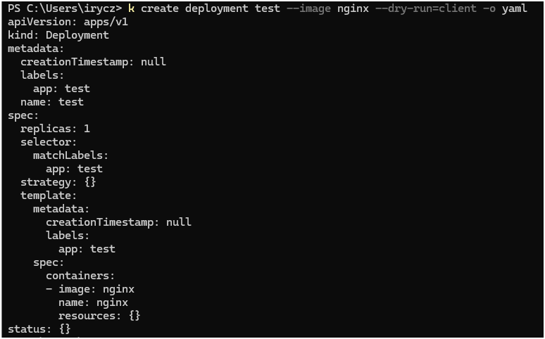
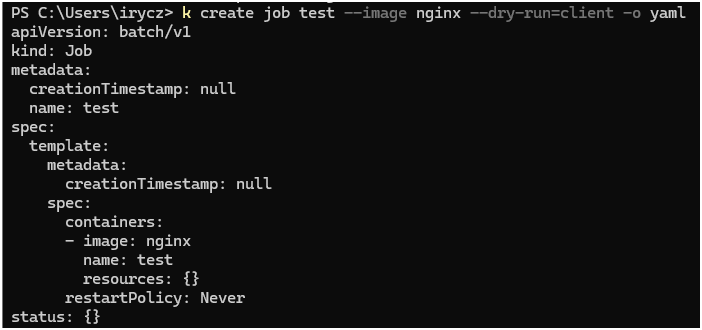
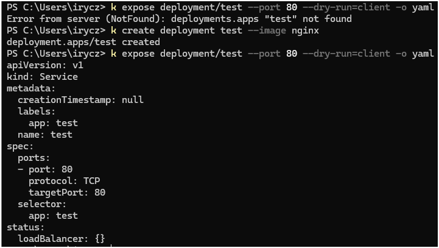

# Management techniques
## Resource generators
Some of the commands used so far like run, expose, create… have automation behind them called generators. The generators create the specification to apply to the cluster, based on the kubernetes options. So when using this commands many options get filled by defaults that we aren't specifing in the command line. 

Here we are creating a deployment with some options, the generator will fill the rest of the specification with a generator.
``kubectl create deployment sample --image nginx --dry-run=client -o yaml``

Generators are different for each type of resource created (service, deployment, job …). Generators aren't constantly the same, when k8s get's updated some generators may too. That's why generators have their own versions (beta, V1…).

The easiest way to see what specification the actual generator would create is too use the`` --dry-run=client and -o yaml`` options, so we dry run them and output it as yaml. This can be used as a starting point.

The template: is for the ReplicaSet, under that spec the containers it will create. We can see that the resources get nested Deployment -> ReplicaSet -> Pods

Jobs is designed to create a set of pods to run them once.
``k create job test --image nginx --dry-run=client -o yaml``
 

We don't have the multiple levels of deployment and replica sets so we don't need the nested specifications in the yaml. So first spec is for the job and the next one for each container pod.

This next expose won't work as the generators need a deployment already created. 
``k expose deployment/test --port 80 --dry-run=client -o yaml``

We can see that the spec is all about ports and protocols, because that's what a service is it's a combination of network routes, network subnetting and udp and tcp ports. 

## Imperative vs declarative

### Kubernetes imperative
- Examples: k run, create deployment, update…
- We start with a state we know
- We ask kubectl to create a deployment
- Different commands are required to change that deployment
- Different commands are required per object
- Imperative is easier when you know the state
- Imperative is easier for humans at the CLI but it isn't easy to automate

### Kubernetes declarative
- Example kubectl apply -f my-resource.yaml
- I don't know the state I know the end state I want (the yaml contents).
- Same command each time (tiny exception for delete)
- Resources can be all in a file, or many files (apply a whole dir).
- For production and automation and creating a repeating loop, we need a more declarative approach which requires the understanding of the YAML keys and values.
- More work than kubectl run for just starting a pod.
- This YAML way is the easiest way to automate the orchestration and great for GitOps methodology.

## Three management aproaches:

https://kubernetes.io/docs/concepts/overview/working-with-objects/object-management/
### 1. Imperative commands: run, expose, scale, edit, create deployment
- Best for dev/ learning/ personal projects
- Easy to learn, hardest to manage over time
- https://kubernetes.io/docs/tasks/manage-kubernetes-objects/imperative-command/
### 2. Imperative objects: create -f file.yml, replace -f file.yml, delete…
- Good for prod or small environments, single file per command
- It is a middle gound between imperative and declarative
- You store your changes in git-based yaml files
- Hard to automate
- https://kubernetes.io/docs/tasks/manage-kubernetes-objects/imperative-config/
### 3. Declarative objects: apply -f file.yml or dir\, diff
- Best for prod, easier to automate
- Harder to understand and predict changes
- https://kubernetes.io/docs/tasks/manage-kubernetes-objects/declarative-config/

#### Most important rule: 
- Don't mix the three aproaches
- Use git to have a history of changes to the yamls (which will save lots of time)

#### Bret's recommendations:
- Learn the imperative CLI for easy control of local and test setups
- Move to apply -f file.yml and apply -f directory\ for prod
- Store yaml in git, git commit each change before you apply
- This trains you for GitOps (where git commits are automatically applied to clusters)

