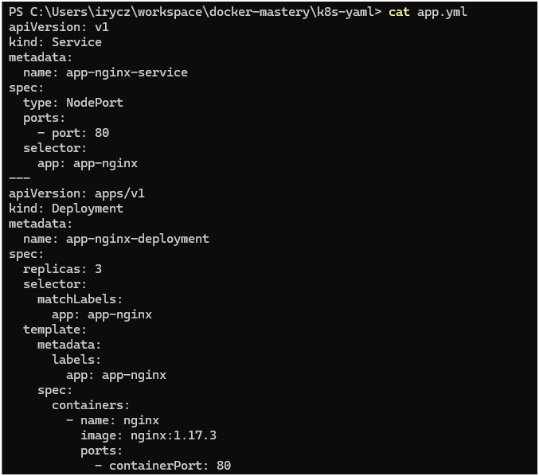
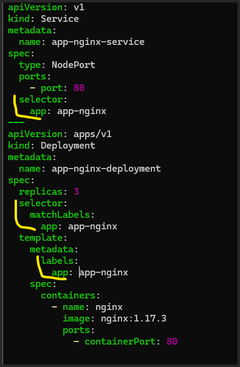

# Introduction
Declarative style, the one suited for DevOps relies on few commands, mainly:
``kubectl apply -f filename.yml``
``kubectl apply -f myyaml/``
Create/ update resources in a file/ directory

Kubernetes configuration YAML
As k8s still evolves and somer resources get outdated or get new verrsions we may get errors like I don't support this api version or don't know this kind of resource. The kind + the apiVersion decide which resource we get and which apiVersion we can use for that resource.

Kind: We can get a list of resources the cluster supports ``kubectl api-resources``
apiVersion: We can get the API versions the cluster supports ``kubectl api-versions``
Metadata: only name si required
Spec: where all the action is at!

List all the keys we can put in a yaml for our resource
``kubectl explain <resourceKind> --recursive``

List the keys for the spec of the service with details:
``kubectl explain services.spec``
``kubectl explain services.spec.type``

Spec: can have sub spec: of other resources
``kubectl explain deployment.spec.template.spec.volumes.nfs.server``
https://kubernetes.io/docs/reference/#api-reference

Labels and annatations

Labels
    - Labels simple list of key: value for identifyin your resource later by selecting, grouping, or filtering for it
    - Common examples: tier: frontend, app: api, env: prod, customer: acme.co
    - Not meant to hold complex, large, or non-identifying info, which is what annotations are for
    - We use them usually for filtering: kubectl get pods -l app=nginx or even apply stuff kubectl apply -f myfile.yml -l app=nginx
Annotations
    - Usually less for describing and more for configuration

Label selectors
    - There are certain resources that talk to other resources or connect to them or are related to them. For example the services need to know which pod to send their traffic to. When creating a service you point it to the deployment but really it uses label selectors

    - In the case of swarm it does something similar but in the background, we can't control it
    - Here we can possibly have a service talk to multiple deployments using the selectors
    - Use labels and selectors to control which pods go to which nodes
    - Taints and tolerations also control node placement (you tell nodes they can't use certain things)
    
